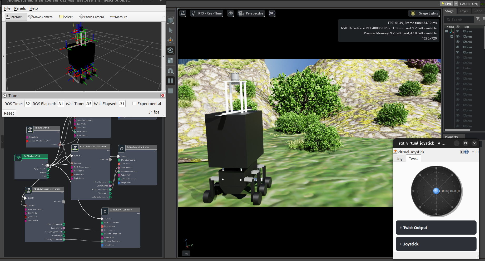

# Custom Robot Control/Navigation and Perception in Simulation: From Gazebo to Isaac Sim



## Project Overview

This repository houses a comprehensive ROS 2 control, navigation, and perception stack designed for a custom 6-wheel swerve-drive robot (`shl-1`). While originally inspired by a course curriculum, this project has been significantly expanded to focus on robust simulation in **NVIDIA Isaac Sim** and **Gazebo**, featuring custom-built outdoor environments and advanced autonomous capabilities.

The core objective is to demonstrate a highly adaptable simulation framework that supports complex terrain navigation, modular robot configurations, and the transition from classical control to vision-based perception.

## Key Features

### 🌍 Custom Outdoor Terrains in Isaac Sim
Unlike standard flat-plane simulations, this project features complex, unstructured outdoor environments.
- **Procedural Generation**: Utilizes **NVIDIA Replicator** and other Isaac Sim utilities to generate diverse outdoor terrains.
- **Realistic Testing**: These custom terrains challenge the navigation stack, providing a rigorous testbed for suspension dynamics and path planning algorithms.

### 🎮 Advanced Control & Navigation
The control stack has been engineered to handle the unique kinematics of a multi-wheel independent steer/drive robot.
- **Custom Swerve Controller**: A dedicated C++ ROS 2 controller (`rse_shl1_swerve_controller`) that manages the kinematics for 6 independent steering and driving wheels, optimizing for agile omnidirectional movement.
- **Autonomous Navigation**: Beyond simple teleoperation, the system features a full autonomous navigation stack capable of path planning and obstacle avoidance in complex environments.
- **Virtual Joystick**: Includes a virtual joystick implementation for manual override and testing.

### 🤖 Modular & Adaptable Robot Design
- **Robot Swapping**: The framework is designed with modularity in mind, allowing the primary robot (`shl-1`) to be easily swapped or modified to showcase adaptability across different platforms.
- **Sensor Suite**: The robot URDF is equipped with a rich array of sensors to support perception tasks, including:
  - **Lidar**: RS-Helios 3D Lidar.
  - **Vision**: ZED2 Stereo Camera.
  - **Positioning**: GNSS and IMU integration.
  - **Proximity**: Array of ultrasound sensors for near-field obstacle detection.

### 👁️ Perception & Vision-Based Navigation (WIP)
Current development is focused on closing the loop between perception and control.
- **Vision Integration**: Leveraging the onboard ZED2 cameras for depth estimation and visual odometry.
- **Perception-Driven Nav**: Developing algorithms to allow the robot to navigate solely or primarily based on visual input, reducing reliance on GNSS/Lidar in specific scenarios.

## Package Structure

The repository is organized into standard ROS 2 packages:

- **`rse_shl1_control`**: Contains configuration for the `ros2_control` framework, defining the interface for the custom swerve controller and joint group controllers.
- **`rse_shl1_description`**: Holds the URDF/Xacro robot descriptions, meshes, and RViz configurations. It supports distinct configurations for Gazebo and Isaac Sim to handle differences in physics engines.
- **`rse_shl1_gazebo`**: Launch files and worlds for the Gazebo simulation environment.
- **`rse_shl1_isaac`**: The primary entry point for Isaac Sim integration, bridging ROS 2 topics with the Isaac Sim physics simulation.
- **`rse_shl1_swerve_controller`**: Source code for the custom kinematic controller plugin.

## Getting Started

### Prerequisites
- ROS 2 (Humble/Foxy)
- NVIDIA Isaac Sim
- `ros2_control` and `ros2_controllers`

### Installation
1. Clone the repository into your ROS 2 workspace:
   ```bash
   cd ~/ros2_ws/src
   git clone <your-repo-url>
Install dependencies:

Bash

rosdep install --from-paths src --ignore-src -r -y
Build the packages:

Bash

colcon build --symlink-install
Running the Simulation
To launch the simulation in Isaac Sim with the full control stack:

Bash

ros2 launch rse_shl1_isaac isaac.launch.py
This will spawn the shl-1 robot, load the custom swerve controllers, and start the ROS 2 control manager.

Future Work
Completion of the Vision-Based Navigation stack.

Reinforcement Learning (RL) integration for terrain traversal optimization.

Further expansion of procedural terrain generation rules.

This project is a fork based on coursework, significantly extended by Rushabh Dhoke to include custom perception, Isaac Sim replicator workflows, and advanced autonomous control.
